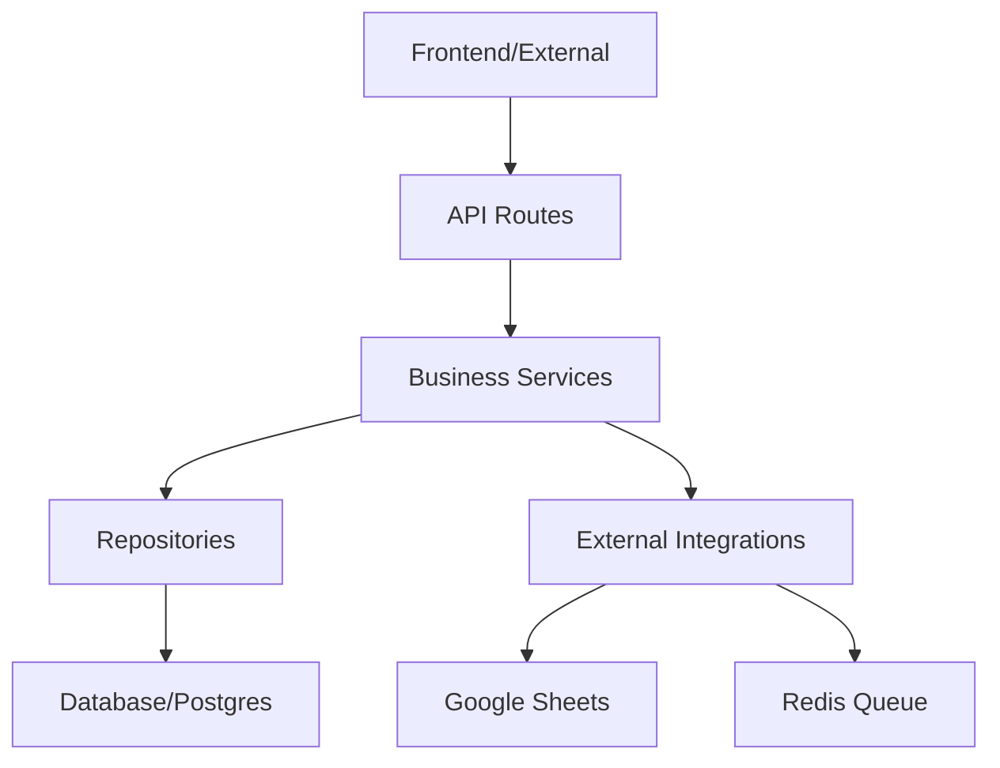

# Email Campaign Tracker - Architecture & Developer Guide

## 🏗️ System Architecture

The project follows a strict **layered architecture** to ensure maintainability, scalability, and ease of testing.

### 1. Layers & Data Flow


*   **API Routes (`app/api/routes/`)**: Handle HTTP requests, input validation (Pydantic), and response mapping. They **never** touch the database directly.
*   **Services (`app/services/`)**: The "Brain" of the app. Orchestrate business logic, call multiple repositories, and interact with external integrations.
*   **Repositories (`app/repositories/`)**: Pure data access layer. Responsible for SQL queries and DB interaction.
*   **Core (`app/core/`)**: Cross-cutting concerns like Security, Logging, Browser management, and Settings.
*   **Workers (`app/workers/`)**: Background processes that execute long-running tasks (Scraping).

---

## 🛠️ Developer Onboarding

### 1. Local Setup
1.  **Clone the Repo**: Ensure you are on the `dev` branch.
2.  **Environment**: 
    ```bash
    cp .env.example .env
    # Update .env with your local Redis and Database credentials
    ```
3.  **Install Dependencies**:
    ```bash
    pip install -r requirements.txt
    ```
4.  **Database Migration**:
    ```bash
    # Run the SQL script found in c:/git/Drip_Campaign_Database_Script.sql
    ```

### 2. Running the System
*   **Backend**: `uvicorn app.main:app --reload --port 8001`
*   **Worker**: `python -m app.workers.scraper_worker`
*   **Redis**: Ensure Redis is running on port 6379.

---

## 🛡️ Reliability Standards

### 1. Atomic State Machine (Phase 2)
All scraper jobs follow a strict state transition: `queued -> running -> succeeded | failed`. We use **Optimistic Locking** (`version` column) to prevent concurrent worker collisions.

### 2. Distributed Locking (Phase 3)
Chrome profiles are locked in Redis during scraping. This prevents session corruption and protects LinkedIn accounts from multi-login flags.

### 3. Tracking Idempotency
All tracking events have a **10-second cooldown** per lead to prevent duplicate counts from email scanners.

---

## 📝 Logging Standards

We use structured logging with the following fields:
*   `request_id`: Correlates all logs within a single HTTP request.
*   `job_id`: Correlates all logs for a specific scraper job.
*   `lead_id`: Used when tracking lead-specific activity.

**Log Levels**:
*   `INFO`: Normal system lifecycle events.
*   `WARNING`: Recoverable errors (e.g., retrying a scrape).
*   `ERROR`: Critical failures requiring intervention.
