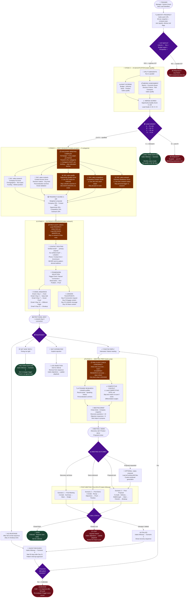

```mermaid
flowchart TD
    %% ─────────────────────────────────────────
    %% STAGE 1 — DISCOVERY
    %% ─────────────────────────────────────────
    START([🚀 TRIGGER\nManager / System Event\nNew Lead Identified])
    IDENTIFY["🔍 IDENTIFY PROSPECT\n/sales quick URL\n60-sec snapshot — company type,\nsize signals, obvious red flags"]
    ICP_GATE{"🎯 ICP MATCH?\nIndustry ✓  Size ✓\nBudget signal ✓  Geography ✓"}
    DISQUALIFY_EARLY(["❌ DISQUALIFY\nLog reason\nAdd to awareness list only"])

    START --> IDENTIFY
    IDENTIFY --> ICP_GATE
    ICP_GATE -- "NO — outside ICP" --> DISQUALIFY_EARLY

    %% ─────────────────────────────────────────
    %% STAGE 2 — QUALIFICATION
    %% ─────────────────────────────────────────
    subgraph STAGE2 ["⚡ STAGE 2 — AI QUALIFICATION  [/sales qualify]"]
        direction TB
        QUAL_SPLIT["🤖 SPLIT SUBAGENTS\nRun in parallel"]
        BANT["📊 BANT SCORING\nBudget · Authority\nNeed · Timeline\n/sales qualify"]
        MEDDIC["📋 MEDDIC ASSESSMENT\nMetrics · Economic Buyer\nDecision Criteria · Pain\nChampion\n/sales qualify"]
        QUAL_MERGE["📈 MERGE SCORES\nOpportunity Quality Score 0–100\nLead Grade: A / B / C / D"]
        QUAL_SPLIT --> BANT & MEDDIC
        BANT & MEDDIC --> QUAL_MERGE
    end

    ICP_GATE -- "YES — matches ICP" --> STAGE2

    QUAL_GATE{"🏆 LEAD GRADE?\nA → 75–100\nB → 50–74\nC → 25–49\nD → 0–24"}
    NURTURE_LONG(["🌱 LONG-TERM NURTURE\n/sales followup — Scenario 5\nMonthly value emails\nRe-qualify in 60–90 days"])
    DISQUALIFY_QUAL(["❌ DISQUALIFY\nD-grade — poor fit\nMarketing awareness only"])

    QUAL_MERGE --> QUAL_GATE
    QUAL_GATE -- "C — lukewarm" --> NURTURE_LONG
    QUAL_GATE -- "D — poor fit" --> DISQUALIFY_QUAL

    %% ─────────────────────────────────────────
    %% STAGE 3 — DEEP RESEARCH (A / B leads)
    %% ─────────────────────────────────────────
    subgraph STAGE3 ["🔬 STAGE 3 — DEEP RESEARCH  [/sales prospect — 5 subagents]"]
        direction TB
        PROSPECT_NOTE["📋 DISCOVERY BRIEFING COMPILED\nHomepage + 5 key pages pre-fetched\nPassed to ALL subagents\n⚠️ Subagents MUST use briefing — skip redundant fetches"]
        SA1["🏢 SA1: sales-research\nCompany Fit Score\nFirmographics · Tech stack\nFunding · Market position"]
        SA2["👥 SA2: sales-contacts\nContact Access Score\nDecision makers · Org chart\nPersonalization anchors\nEmail validation"]
        SA3["📊 SA3: sales-qualify\nOpportunity Quality Score\n⚠️ Use SA2 output for Authority\nSkip LinkedIn searches if\nDECISION-MAKERS.md exists"]
        SA4["⚔️ SA4: sales-competitors\nCompetitive Position Score\n⚠️ Use SA1 tech stack output\nSkip job-post re-scan"]
        SA5["✉️ SA5: sales-outreach\nOutreach Readiness Score\n⚠️ Use SA2 contacts output\nSkip personal trigger re-research"]
        PROSPECT_MERGE["🏆 PROSPECT SCORE 0–100\nWeighted composite\nCompany 25% · Contact 20%\nOpportunity 20% · Competitive 15%\nOutreach 20%"]
        PROSPECT_NOTE --> SA1 & SA2 & SA3 & SA4 & SA5
        SA1 & SA2 & SA3 & SA4 & SA5 --> PROSPECT_MERGE
    end

    QUAL_GATE -- "A or B — qualified" --> STAGE3

    %% ─────────────────────────────────────────
    %% STAGE 4 — OUTREACH GENERATION
    %% ─────────────────────────────────────────
    subgraph STAGE4 ["✉️ STAGE 4 — OUTREACH SEQUENCE  [/sales outreach]"]
        direction TB
        OUTREACH_NOTE["📋 PRE-FLIGHT CHECK\nLoad PROSPECT-ANALYSIS.md\nLoad DECISION-MAKERS.md\nSkip re-research if files exist"]
        CONTACT_ROUTE["🎯 CONTACT ROUTING\nVerified email? → primary channel\nNo verified email? → LinkedIn /\nPhone / Contact form / Enrichment\nNEVER send to pattern-derived address"]
        FRAMEWORK["🔧 FRAMEWORK SELECTION\nTrigger Event / Mutual Connection /\nObservation→Ask / Problem→Proof"]
        EMAIL_SEQ["📧 5-EMAIL SEQUENCE\nEmail 1 Day 1 — Hook\nEmail 2 Day 3 — Value Add\nEmail 3 Day 7 — Social Proof\nEmail 4 Day 14 — Different Angle\nEmail 5 Day 21 — Breakup"]
        LINKEDIN_SEQ["💼 LINKEDIN TOUCHPOINTS\nDay 0 Connection request\nDay 5 Engage content\nDay 10 LinkedIn message\nDay 18 Share content"]
        OUTREACH_NOTE --> CONTACT_ROUTE --> FRAMEWORK --> EMAIL_SEQ
        FRAMEWORK --> LINKEDIN_SEQ
    end

    PROSPECT_MERGE --> STAGE4

    %% ─────────────────────────────────────────
    %% STAGE 5 — RESPONSE HANDLING
    %% ─────────────────────────────────────────
    SEND_EMAIL(["📤 FIRST EMAIL SENT\n+ LinkedIn Day 0 connection"])
    RESPONSE_GATE{"📬 RESPONSE?"}
    POSITIVE["✅ POSITIVE REPLY\nInterested / Wants meeting"]
    NOT_NOW["⏳ 'NOT NOW' REPLY\nTiming not right"]
    NOT_INTERESTED["🚫 'NOT INTERESTED'\nExplicit rejection"]
    NO_RESPONSE["👻 NO RESPONSE\nAfter full 5-email sequence\n(Day 21 breakup sent)"]

    EMAIL_SEQ --> SEND_EMAIL
    SEND_EMAIL --> RESPONSE_GATE
    RESPONSE_GATE --> POSITIVE
    RESPONSE_GATE --> NOT_NOW
    RESPONSE_GATE --> NOT_INTERESTED
    RESPONSE_GATE --> NO_RESPONSE

    NOT_NOW --> NURTURE_MEDIUM(["🌱 MID-TERM NURTURE\n/sales followup — Scenario 5\nSet re-engage trigger\nCheck in at agreed date"])
    NOT_INTERESTED --> LOG_OBJECTION["📝 LOG OBJECTION\nAsk for referral\nRemove from sequence\n/sales objections — update playbook"]
    NO_RESPONSE --> GHOST_RECOVERY["👻 GHOST RECOVERY\n/sales followup — Scenario 4\nWait 30 days after Day 21\nPattern interrupt approach"]
    GHOST_RECOVERY --> GHOST_GATE{"Response\nafter ghost\nrecovery?"}
    GHOST_GATE -- "Yes" --> POSITIVE
    GHOST_GATE -- "No — 3 attempts" --> DISQUALIFY_COLD(["❄️ ARCHIVE\nCold — no response after full cycle\nRe-evaluate if trigger event occurs"])

    %% ─────────────────────────────────────────
    %% STAGE 6 — MEETING PREP & EXECUTION
    %% ─────────────────────────────────────────
    subgraph STAGE6 ["📋 STAGE 6 — MEETING PREP  [/sales prep]"]
        direction TB
        PREP_NOTE["📋 PRE-FLIGHT CHECK\nIf PROSPECT-ANALYSIS.md exists → load it\nIf COMPANY-RESEARCH.md exists → skip re-fetch\nOnly fetch what is MISSING"]
        PREP_RESEARCH["🔍 ATTENDEE RESEARCH\nLinkedIn profiles\nRecent posts · Speaking history\nPersonalization anchors"]
        PREP_COMPETITIVE["⚔️ COMPETITIVE CONTEXT\n⚠️ Load COMPETITIVE-INTEL.md\nSkip tech-stack re-scan if exists\nDifferentiation angles"]
        MEETING_BRIEF["📄 MEETING BRIEF\nCheat sheet · Company snapshot\nDiscovery questions × 10\nObjection responses × 5\nNext steps to propose"]
        PREP_NOTE --> PREP_RESEARCH & PREP_COMPETITIVE --> MEETING_BRIEF
    end

    POSITIVE --> STAGE6

    MEETING(["🤝 MEETING / DEMO\nDiscovery call / Product demo\nProposal review"])
    MEETING_BRIEF --> MEETING

    %% ─────────────────────────────────────────
    %% STAGE 7 — POST-MEETING FOLLOW-UP
    %% ─────────────────────────────────────────
    MEETING_OUTCOME{"📊 MEETING OUTCOME?"}
    MEETING --> MEETING_OUTCOME

    subgraph STAGE7A ["📧 POST-MEETING FOLLOW-UP  [/sales followup]"]
        FU_MEETING["Scenario 1 — Post-Meeting\n3 emails · Summary → Value → Nudge"]
        FU_DEMO["Scenario 2 — Post-Demo\n4 emails · Recap → Objections → Proof → Timeline"]
        FU_PROPOSAL["Scenario 3 — Post-Proposal\n5 emails · Delivery → Walkthrough → Value → Checkin → Breakup"]
    end

    MEETING_OUTCOME -- "Discovery call done" --> FU_MEETING
    MEETING_OUTCOME -- "Demo delivered" --> FU_DEMO
    MEETING_OUTCOME -- "Proposal sent" --> FU_PROPOSAL

    DEAL_GATE{"🏁 DEAL STATUS"}
    FU_MEETING & FU_DEMO & FU_PROPOSAL --> DEAL_GATE

    WON(["🎉 WON\nOnboard · Request case study\nAsk for referrals"])
    LOST(["😞 LOST\nLog loss reason\n/sales objections — update playbook\nNurture for future cycle"])
    STALLED["⏸️ STALLED\n/sales followup — Scenario 4\nGhost recovery sequence"]

    DEAL_GATE -- "Closed Won" --> WON
    DEAL_GATE -- "Closed Lost" --> LOST
    DEAL_GATE -- "Ghosted / Stalled" --> STALLED
    STALLED --> GHOST_RECOVERY

    %% ─────────────────────────────────────────
    %% OPTIONAL: PROPOSAL GENERATION
    %% ─────────────────────────────────────────
    PROPOSAL_OPT["📄 OPTIONAL: /sales proposal\nLoad all existing MD files\nCustom proposal generation"]
    MEETING_OUTCOME -- "Proposal requested" --> PROPOSAL_OPT
    PROPOSAL_OPT --> FU_PROPOSAL

    %% ─────────────────────────────────────────
    %% STYLES
    %% ─────────────────────────────────────────
    classDef stage fill:#1a1a2e,stroke:#4cc9f0,color:#fff,font-weight:bold
    classDef decision fill:#4a0e8f,stroke:#b5179e,color:#fff
    classDef action fill:#023e8a,stroke:#0096c7,color:#fff
    classDef terminal_good fill:#1b4332,stroke:#52b788,color:#fff
    classDef terminal_bad fill:#6b0f1a,stroke:#e63946,color:#fff
    classDef warning fill:#7b2d00,stroke:#f4a261,color:#fff

    class ICP_GATE,QUAL_GATE,RESPONSE_GATE,GHOST_GATE,MEETING_OUTCOME,DEAL_GATE decision
    class DISQUALIFY_EARLY,DISQUALIFY_QUAL,DISQUALIFY_COLD,LOST terminal_bad
    class WON,NURTURE_LONG,NURTURE_MEDIUM terminal_good
    class PROSPECT_NOTE,OUTREACH_NOTE,PREP_NOTE,SA3,SA4,SA5 warning
```
